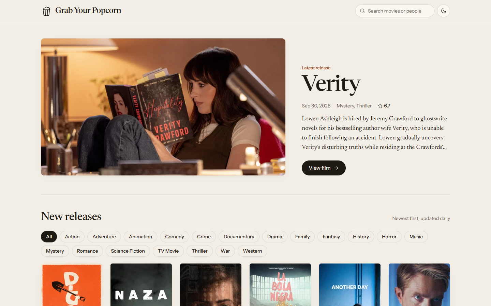
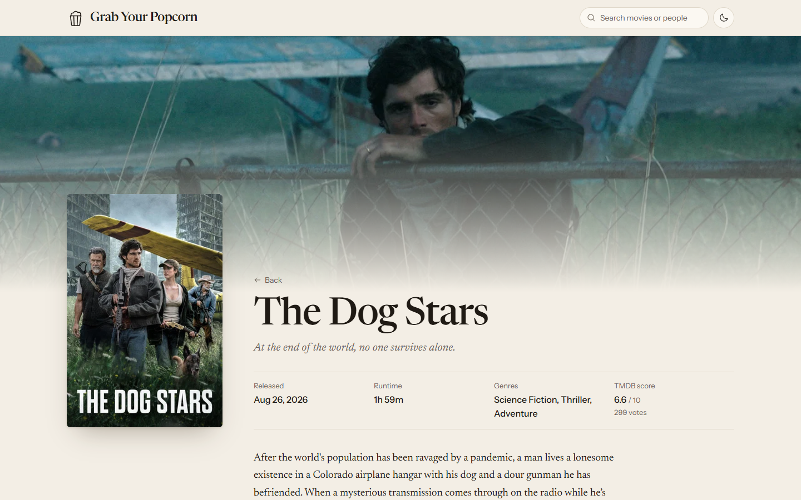
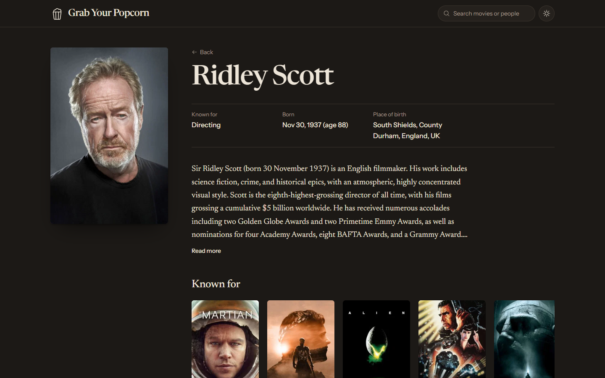
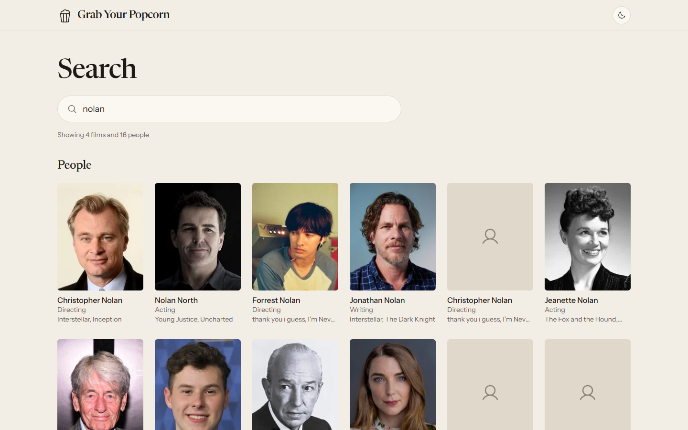
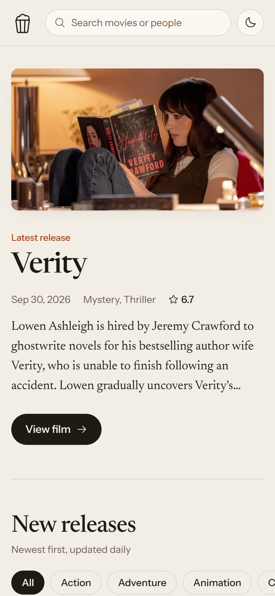
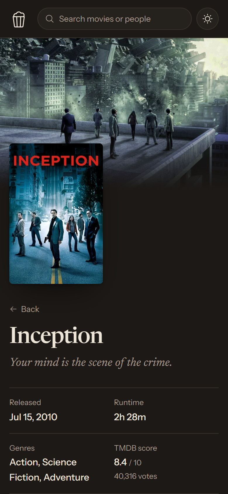

# Grab Your Popcorn

Find your next film. Browse the latest releases, then dig into any film or actor:
synopsis, cast and crew, trailer, reviews, related films and full filmographies.
All data comes from [TMDB](https://www.themoviedb.org/).

**Live demo: [dfabiorc.github.io/grab-your-popcorn](https://dfabiorc.github.io/grab-your-popcorn/)**



<table>
  <tr>
    <td></td>
    <td></td>
  </tr>
  <tr>
    <td></td>
    <td>
      
      
    </td>
  </tr>
</table>

## Features

- **Newest releases first**, with a featured film and an infinite-scroll grid sorted by
  release date. Filter by genre; the filter lives in the URL, so it can be shared.
- **Film pages** with backdrop, poster, release date, runtime, genres, score and votes,
  director and writers, a trailer that loads only when you press play, cast with
  photos and characters, TMDB reviews and "More like this".
- **Person pages** with photo, biography, "Known for" and a filmography by department,
  newest first.
- **Search** for films and people as you type.
- **Every page has a shareable URL** that survives a reload, including on GitHub Pages.
- **Light and dark themes** (follows the system, remembers your choice).
- **Accessible**: keyboard navigation with visible focus, screen-reader labels,
  reduced-motion support, WCAG AA contrast, skeleton, empty and error states. Checked
  automatically with axe in the end-to-end tests.

## Tech stack

Vite · React 19 · TypeScript · Tailwind CSS v4 · React Router v8 (hash routing) ·
TanStack Query · Phosphor icons · Vitest · Playwright + axe · oxlint · Prettier ·
GitHub Actions + GitHub Pages.

The reasoning behind each choice, and the alternatives that were discarded, are in
[docs/DECISIONS.md](docs/DECISIONS.md). The visual system (colours, type, spacing,
motion) is documented in [DESIGN.md](DESIGN.md).

## Getting started

Requirements: Node.js 22 or newer (`.nvmrc` pins 24) and a free
[TMDB API key](https://www.themoviedb.org/settings/api).

```bash
git clone https://github.com/dfabiorc/grab-your-popcorn.git
cd grab-your-popcorn
npm install
cp .env.example .env.local   # then paste your key into .env.local
npm run dev
```

Open the URL Vite prints, including the base path, for example
`http://localhost:5173/grab-your-popcorn/`.

### Environment variables

| Variable            | Required | Description                                                                                                                                                                         |
| ------------------- | -------- | ----------------------------------------------------------------------------------------------------------------------------------------------------------------------------------- |
| `VITE_TMDB_API_KEY` | Yes      | TMDB **v3 API key** (the short "API Key", not the long read access token). Put it in `.env.local`, which is git-ignored. Without it the app shows a "TMDB API key missing" message. |

> **About the key.** This is a static site, so the browser calls TMDB directly and
> the key ends up in the published JavaScript. Anyone inspecting the network traffic
> can see it. It is a read-only TMDB key used only for public data, it is never
> committed to the repository (CI injects it from a secret at build time) and it can
> be rotated at any time. A free proxy that would hide it is described in
> [docs/DECISIONS.md](docs/DECISIONS.md#3-the-tmdb-api-key-is-visible-on-purpose).

### Scripts

| Command                           | What it does                                                          |
| --------------------------------- | --------------------------------------------------------------------- |
| `npm run dev`                     | Development server with hot reload                                    |
| `npm run build`                   | Type check and production build into `dist/`                          |
| `npm run preview`                 | Serve the production build locally under `/grab-your-popcorn/`        |
| `npm test`                        | Unit tests (Vitest)                                                   |
| `npm run e2e`                     | End-to-end tests (Playwright) against a production build, TMDB mocked |
| `npm run lint`                    | Lint (oxlint)                                                         |
| `npm run format` / `format:check` | Format with Prettier / check formatting                               |
| `npm run typecheck`               | TypeScript, all projects                                              |

For `npm run e2e`, Playwright needs a browser: run `npx playwright install chromium`
once, or reuse one you already have with `PLAYWRIGHT_CHANNEL=msedge npm run e2e`
(or `chrome`). The tests need no API key.

## Deployment

Every push and pull request runs lint, formatting, type check, unit tests and
end-to-end tests ([.github/workflows/deploy.yml](.github/workflows/deploy.yml)).
Pushes to `main` that pass are built with the real key and published to GitHub Pages.

To deploy your own copy:

1. **Settings → Pages → Build and deployment → Source: GitHub Actions.**
2. **Settings → Secrets and variables → Actions → New repository secret**, named
   `TMDB_API_KEY`, with your TMDB v3 API key as the value. With the GitHub CLI:
   `gh secret set TMDB_API_KEY`.
3. If your repository has a different name, change `BASE` in `vite.config.ts`, the
   URLs in `index.html` and the base path in `playwright.config.ts` to match.
4. Push to `main`.

## Architecture

```
src/
├── api/          TMDB client, endpoints, query definitions, shared QueryClient
├── components/   Layout, header, footer, cards, rows, and ui/ primitives
├── config/       app.ts (language, API base, thresholds), strings.ts (UI copy)
├── features/     home/, movie/, person/, search/: one folder per page
├── hooks/        debounce, document title, image base, infinite-scroll sentinel
├── lib/          pure logic: formatting, images, credits, filmography (unit tested)
├── styles/       index.css: Tailwind v4 theme tokens, motion utilities
├── types/        TMDB response types
└── routes.tsx    hash router, lazy pages and prefetching loaders
e2e/              Playwright tests with synthetic TMDB fixtures
docs/             DECISIONS.md, screenshots
```

**How a page gets its data.** Navigating to `#/movie/123` runs the route's loader,
which _starts_ the TMDB request without waiting for it. In parallel the page's code
chunk loads and renders a skeleton. The page then reads the same query from TanStack
Query's cache. Everything stays in memory for the session, so going back to a page
costs no extra request.

**Performance.** Lighthouse on the production build: 98–99 performance on desktop and
82–90 on simulated slow mobile, with 100 accessibility, best practices and SEO on
every page. Details in [docs/DECISIONS.md](docs/DECISIONS.md#8-performance).

## Limitations

- **The API key is visible** in the published bundle (see above).
- **Hash URLs** (`/#/movie/123`) are needed because GitHub Pages cannot rewrite routes.
  Per-film social previews are not possible without a server.
- **Mobile LCP** depends on JS + API + image in sequence; server rendering would help,
  but GitHub Pages cannot run a server.
- **Data quality is TMDB's.** Brand-new releases may lack a synopsis or votes; the home
  feed hides films with fewer than 20 votes for that reason.
- **The interface is in English.** The language can be changed in one place
  (`src/config/app.ts`), but only English UI copy is written.
- **Films and people only.** TV shows are filtered out of search.

## Credits

Film and person data and images are provided by [TMDB](https://www.themoviedb.org/).


This product uses TMDB and the TMDB APIs but is not endorsed, certified, or otherwise
approved by TMDB.

Fonts: [Newsreader](https://fonts.google.com/specimen/Newsreader) and
[Instrument Sans](https://fonts.google.com/specimen/Instrument+Sans) (SIL Open Font
License), self-hosted via Fontsource. Icons: [Phosphor](https://phosphoricons.com/).

## License

[MIT](LICENSE) © 2026 dfabiorc. TMDB data and images remain subject to the
[TMDB terms of use](https://www.themoviedb.org/api-terms-of-use).
